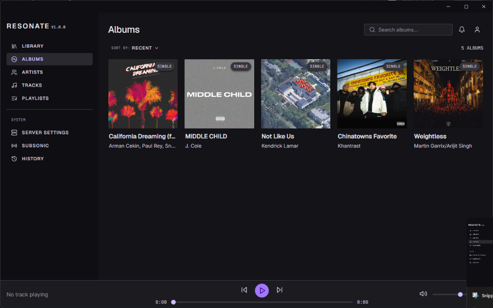
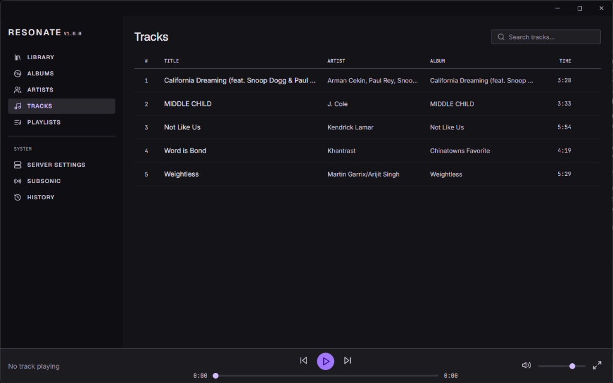
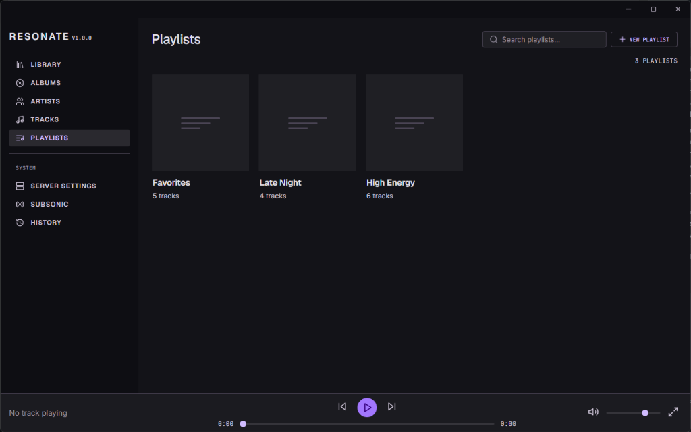

# Project Resonate

*Own your library, press play, enjoy the music.*

> [!WARNING]
> **ACTIVE DEVELOPMENT / TESTING PHASE**
> 
> Local library playback is functional; online streaming (Subsonic integration / server accounts) is planned but NOT YET implemented.
> There is currently no simple one-click installer — running it requires building from source (see instructions below). 
> Anyone is welcome to clone it, run it, break it, and report back — bugs, UX complaints, design opinions, all of it welcome. A simpler distributable build will come once the app exits testing.

## Why this exists

I love music, but I’ve grown increasingly exhausted by modern music software. Everything feels like it's drifting toward engagement-driven metrics, ad-supported interruption, or subscription-gated lock-in. I wanted something different—a push back toward a calmer, ownership-respecting alternative. 

Project Resonate is built around simplicity, ownership, and respect for the listener. It doesn't have ads. It doesn't have engagement-loop algorithms. It just lets you point it at your music files, press play, and enjoy them. While it starts as a local-first application, the vision embraces the convenience of streaming rather than rejecting it outright—meaning you'll eventually be able to stream your own remote Subsonic-compatible libraries seamlessly.

## Screenshots

<!-- TODO: replace with real screenshots -->


*The Albums View — your local collection at a glance.*


*The Tracks View — clean layout for track management.*


*Now Playing — dynamic accent colors and an interactive Up Next queue.*


*Playlists — organize and arrange your tracks.*

## Features

### Working Now
- **Local Library Scanning**: Blazing fast folder scans pulling metadata directly from your audio files.
- **Playback Controls**: Play, pause, seek, and volume control.
- **Up Next Queue**: Interactive click-to-play queue management.
- **Album Art Extraction**: Extracts embedded cover art and caches it efficiently.
- **Dynamic Accent Colors**: The UI seamlessly adapts its color scheme based on the active album art.
- **Library Management**: Per-track delete and manual single-file adding.
- **Playlists**: Create, add, remove, and reorder tracks.
- **Intelligent Badging**: Accurately labels genuine Singles vs. partial albums using embedded file metadata, rather than local library presence.

### Coming Soon / Planned
- **Online Streaming**: Seamless integration with Subsonic-compatible servers.
- **Accounts**: User accounts and login for remote libraries.
- **Sync**: Cross-device sync.

## Tech Stack

- **Tauri v2**: Chosen over Electron to keep the native footprint incredibly light while retaining a modern web frontend.
- **Rust Backend**: Handles the heavy lifting—audio file scanning (`lofty`), native audio playback (`symphonia`), and SQLite orchestration safely and blazingly fast.
- **SvelteKit + TypeScript**: A reactive, compilation-optimized frontend for a snappy, app-like feel.
- **SQLite (`rusqlite`)**: Local database for fast querying and library indexing.
- **Vanilla CSS**: Used over Tailwind or UI frameworks to maintain full, uncompromised control over the design token system and dynamic aesthetics.

## Getting Started (Running from source)

Since we do not yet offer pre-packaged installers, you'll need to run this from source. 

*Note: The project is currently heavily targeted and tested on Windows. Mac/Linux support is theoretically possible via Tauri but is not actively verified yet.*

### Prerequisites
1. **Node.js** (v18+)
2. **npm**
3. **Rust Toolchain** (Install via [rustup](https://rustup.rs/))

### Setup
1. Clone the repository:
   ```bash
   git clone <repository-url>
   cd project-resonate
   ```
2. Install frontend dependencies:
   ```bash
   npm install
   ```
3. Run the development server (starts Vite + Rust backend):
   ```bash
   npm run tauri dev
   ```
4. To build a release executable:
   ```bash
   npm run tauri build
   ```

## How to Contribute / Give Feedback

**I genuinely want your input.** Since this is an early-stage solo project, response times may vary, but all feedback is wanted. 

Whether it's a bug report, UX feedback, a design critique, or a pull request:
- Please open an **Issue** on GitHub to report bugs or start a discussion.
- Code contributions via **Pull Requests** are explicitly welcome. 

## Known Issues / Current Limitations

- **No Online Streaming Yet**: Subsonic integration is planned but not currently functional.
- **No Installers**: You must build from source for now.
- **Windows Focused**: While Tauri is cross-platform, current development and testing is almost exclusively on Windows.
- **Scanner Edge Cases**: Still actively refining metadata extraction and edge cases for obscure audio tagging.

## License

License: TBD
